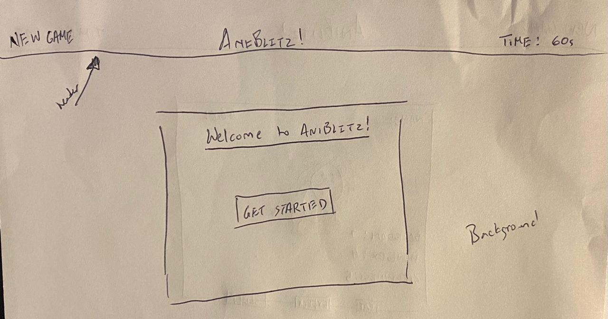
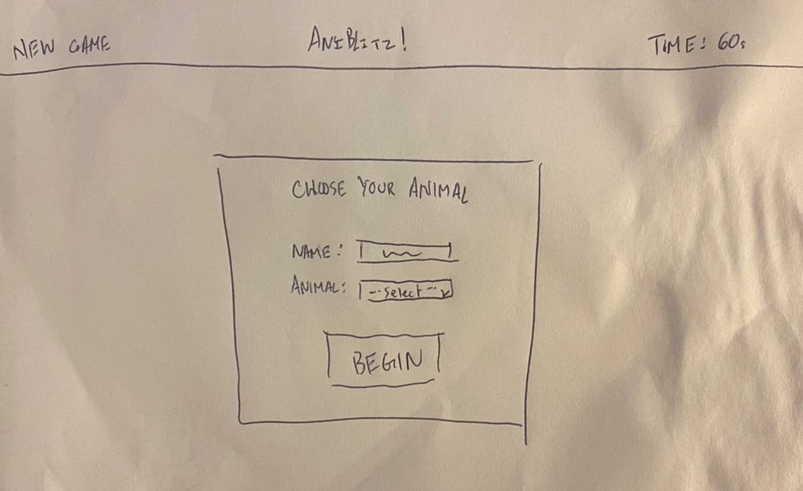
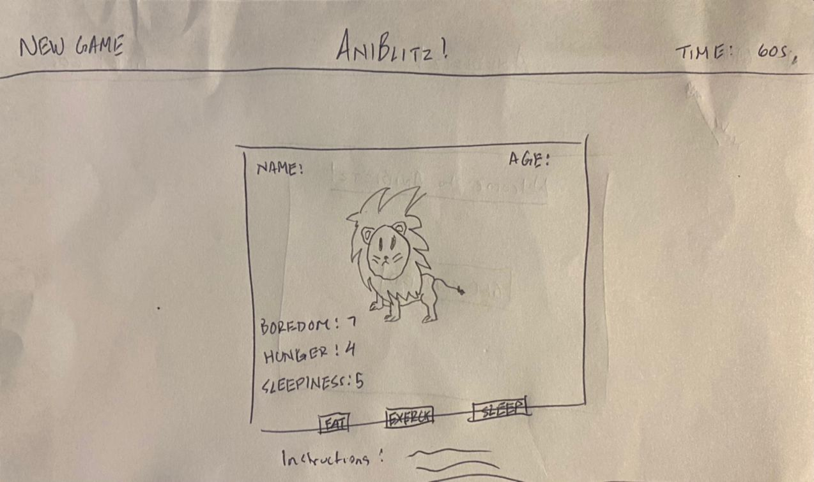

# Explanation
AniBlitz! was created from the inspiration of the famous Japanese handheld Tamagathci game. With a similar approach, AniBlitz! is a game where you train and raise your pet as a footballl player to make it through high school, college and eventually the pros.

Setup:
Name - players have the ability to name their animal of choice
Animals - players have 3 choices of animals to choose at the beginning of the game

Gameplay:
Buttons - players have the ability to strategically decrease the status levels of their animal (if any category reaches to level 10 the animal will die)
Timer - a visual timer is used to increase the status levels of the animals, age the animal and evolve the animal
Day/Night - gameplay screen turns dark when animal is sleep
New Game - player has the option to start fresh and begin a new game 

## User Story
Players will be able to choose and name an animal of thier choice that is a high school football player.
Player will be able to interact with thier animal based off their status of boredom, hunger and sleepiness.
Player will have the opportunity to evolve and advanced their animal from high school to college and from college to the pros.

### Wireframes
Welcome Screen:

Setup Screen:

Gamplay Screen:

#### Technologies
• HTML - used to markup the app with text and directions of the app.
• JavaScript - used to create instances for the animals from a created class and to set globally scoped variables.
• jQuery - used to create event listeners, button functionality, timers, and live updates of the app.
• CSS - used to style the app including the use of @keyFrames to add animation.

##### Approach
The intial apporach was to use vanilla Java Script to create the functiontionality of the application, however the idea was switched to using jQuery to simplify functionality and best organize and simplify code. The complexity of the game concept and functionality was also going to be initialized, but to prevent mistakes and unnecessary roadblocks, a simplier version was establish to create a foundation of the app, which will in result have plenty of areas of growth and improvements.

###### Unsolved Problems
The biggest unsolved problem is the lack of button delays for the gameplay. Players are able to continuously click any gameplay button without any delay. The problem with this is that it creates less of a challenge for the player and devalues the user experience. 